## **GRAYLOG**

Graylog is an open source log management platform which can be used to capture, index, and analyze both structured and unstructured data from virtually any source.. It takes a very wide range of keys and offers a JSON format called GELF for transmitting log data to its servers. Graylog servers let you to specify post-processing operations, such as reformatting data and sending alerts depending on user-defined rules, and they take log streams from several sources.

**Step 1: Installation**

You must have the latest version of Ubuntu 
Update and upgrade the system

sudo apt-get update && sudo apt-get upgrade

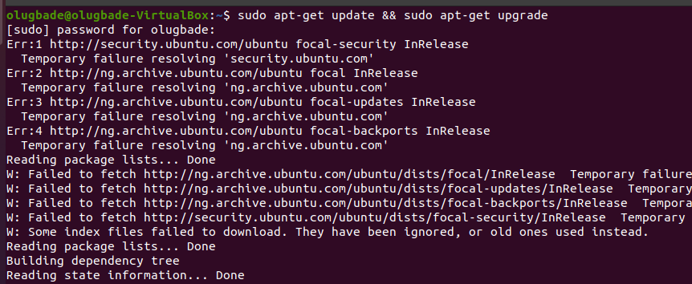

**Step 2 :Install OpenJDK**

You must first install OpenJDK and the other necessary packages using the apt-get install command below since Elasticsearch depends on the Java Platform.

sudo apt-get install apt-transport-https openjdk-17-jre-headless uuid-runtime pwgen

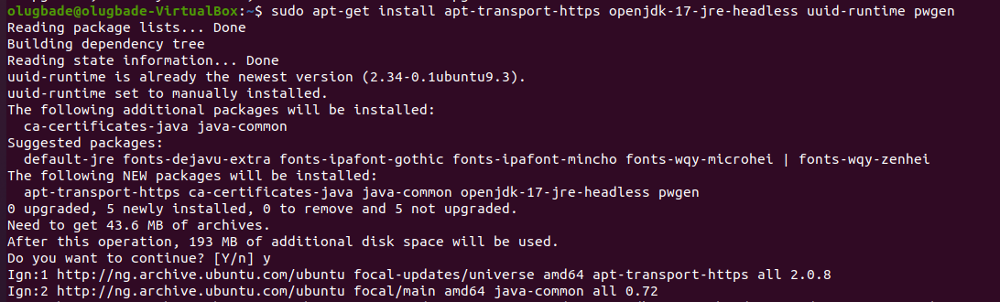

Step 3 : Install MongoDB

Installing MongoDB Server is the next step. The best choice for storing configuration data is MongoDB. It stores metadata information such as user information or Stream Configuration.

* _Import Signed Key_

The signed key must first be imported using the apt-key function listed below.

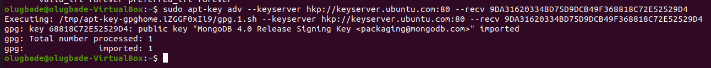

* _Add Repository_

then use the command below to add the MongoDB repository.

echo "deb [ arch=amd64 ] https://repo.mongodb.org/apt/ubuntu bionic/mongodb-org/4.0 multiverse" | sudo tee /etc/apt/sources.list.d/mongodb-org-4.0.list

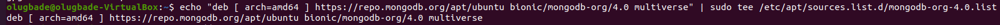

* _Update the System_

You must use the apt-get update command to update the package cache with all the package information from the newly added repository after adding the repository information.

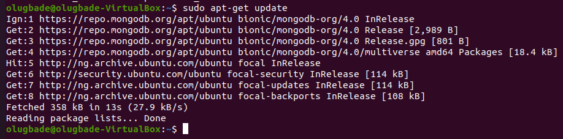

* _Install MongoDB_

Install MongoDB packages and its dependencies in the following step by running the apt-get install -y mongodb-org command as displayed below.

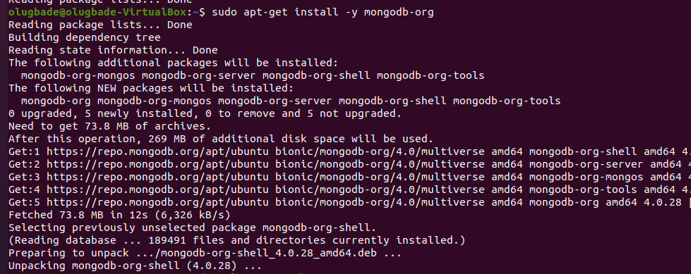

* _Enable MongoDB Service_

Then enable the MongoDB Service by using systemctl enable mongod.service command.

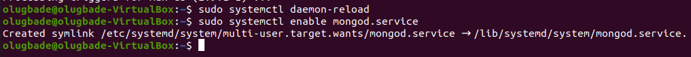

* _Restart MongoDB Service_

Finally, use the systemctl restart mongod command to restart the service. The systemctl status mongod command can be used to check the status of the service.

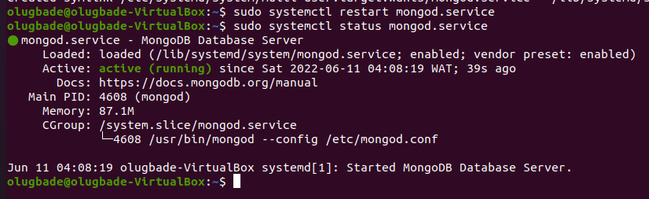

**Step 4: Install Elasticsearch**

Elasticsearch installation must come next. Elasticsearch is used by Graylog to effectively store all of the log data. The information is stored in Apache Lucene indices as an inverted index, which makes searching and analysis easier and faster.

1. Download GPG Key

The Secure GPG Key must first be downloaded using the wget command below from the Elasticsearch Artifacts Page.

2. Add GPG Key

Use the apt-key add myKey command now to add the GPG key. It has been successfully added if the output shows the status as OK.

3. Add Repository

Elasticsearch is not included in the default Ubuntu Repository, like MongoDB, so you must add a different repository in order to use a package manager to download the Elasticsearch packages.

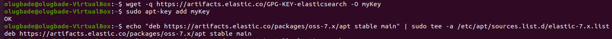

* _Update Server_

Now use the apt-get update command as demonstrated below to update the package cache with all of the package information from the just added repository.

* _Install Elasticsearch_

Installing Elasticsearch using the apt-get install elasticsearch-oss command, as shown below, is the appropriate next step.

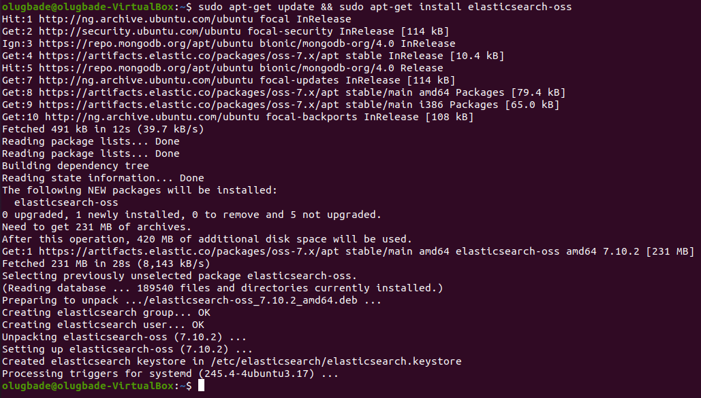

* _Configure Elasticsearch Configuration_

Following a successful installation, you must setup elasticsearch and add the lines listed below.

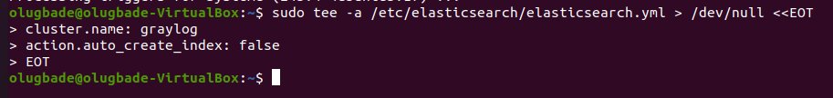

* _Reload Daemon_

Then reload the daemon to take new configuration using systemctl daemon-reload command as shown below.

* _Enable Elasticsearch Service_

Then enable the service by using systemctl enable elasticsearch command as shown below.

* _Restart Elasticsearch Service_

Finally restart the service by using systemctl restart elasticsearch command. You can verify the status by using systemctl status elasticsearch command.

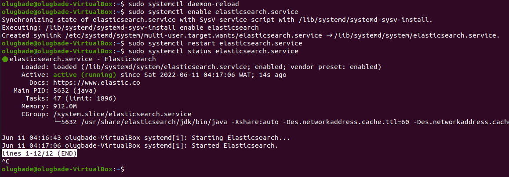

**Step 5: Install Graylog**

Since Graylog is not included in the usual Ubuntu Repository, you must first download and install the Graylog repository package before using a package manager to access the Graylog packages.

* _Download Graylog Repository_

To obtain the most recent.deb package from the Graylog repository, use wget or curl. Here, we're downloading the software to our local system using the wget program.

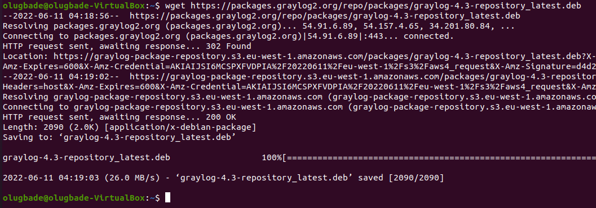

* _Install Repository_

Once downloaded, you can then install the package by using dpkg -i graylog-4.2-repository_latest.deb command as shown below.

* _Update Server_

Then update the package cache with all the package information from Graylog Repository. Without this step, package manager will not able to locate the package.

* _Install Graylog Server_

Once the repository information is fetched, you can install the package by using apt-get install graylog-server command as shown below.

sudo apt-get update && sudo apt-get install graylog-server graylog-enterprise-plugins graylog-integrations-plugins graylog-enterprise-integrations-plugins
 

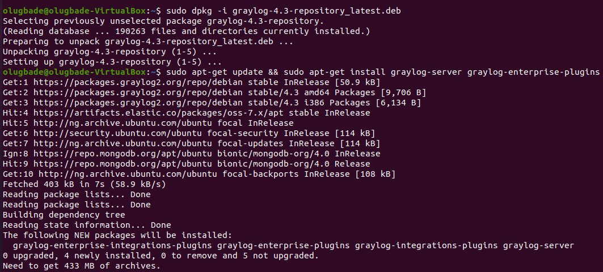

* _Configure Graylog Server_

You must set a secret to secure the stored user passwords. To generate one, use command pwgen -N 1 -s 96 as shown below.

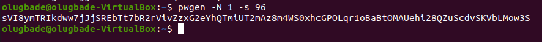

Then you must specify a hash password for the root user using below command. Just for the demo, here we are using password: success10. You are free to choose any strong password.

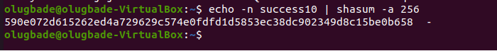

After generating both the password, open server.conf file using nano /etc/graylog/server/server.conf command and set below parameter.

sudo nano /etc/graylog/server/server.conf

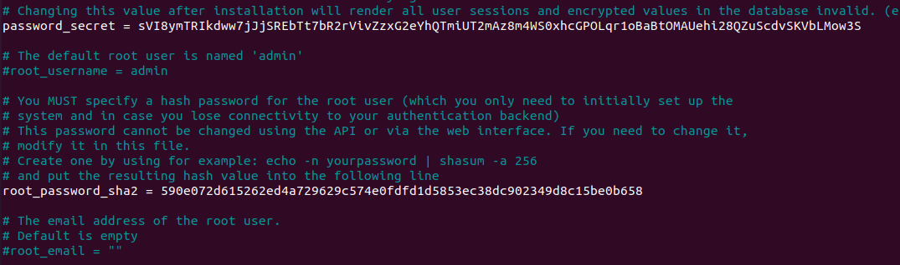

Change the http_bin_address to your local machine IP address and uncomment it (by removing the #)

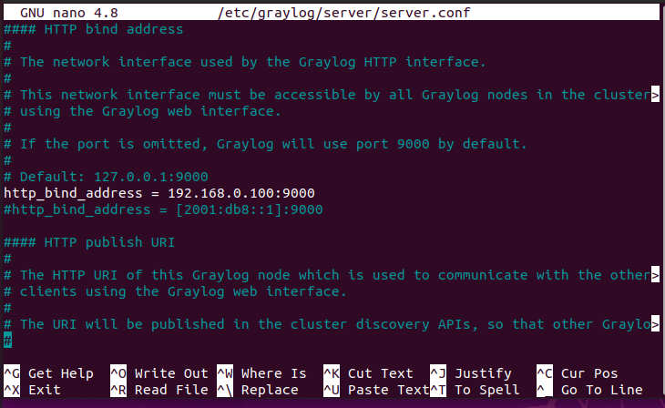

* _Reload Daemon_

Then reload the daemon to take new configuration using systemctl daemon-reload command as shown below.

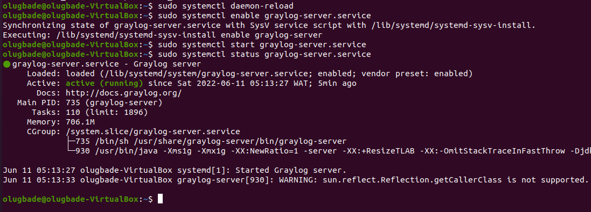

* _Enable Graylog Server_

If you want to start Graylog Server automatically after a crash or reboot then enable the service by using systemctl enable graylog-server command as shown below.

 * _Start Graylog Server_

Once all done, you can now start the service by using systemctl start graylog-server command. You can then verify the status using systemctl status graylog-server command. If it shows active and running then you are all good.

**Step 6: Open Graylog GUI**

Go to your Favorite Browser and use URL http://<local_server_ip>:9000 to open the Graylog Login Page. In my case, local Server IP Address is 192.168.0.100 so I will use http://192.168.0.100:9000 URL in the browser. Once opened, it should show like below where it will ask to provide username and password. Username will be admin and password will be Test@123$ which you have set earlier. Then Click on Sign In.

Once Signed In, you should see a Search Page like below. This confirms the successful installation and working of Graylog Server. Now you can go ahead and configure the Server as per your requirement.

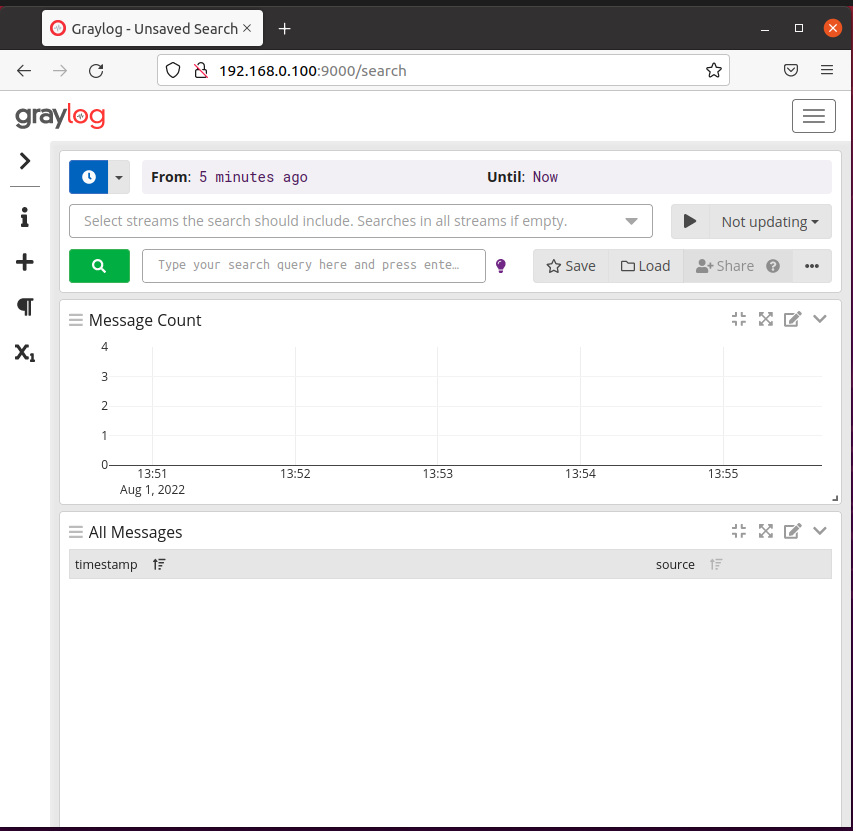

